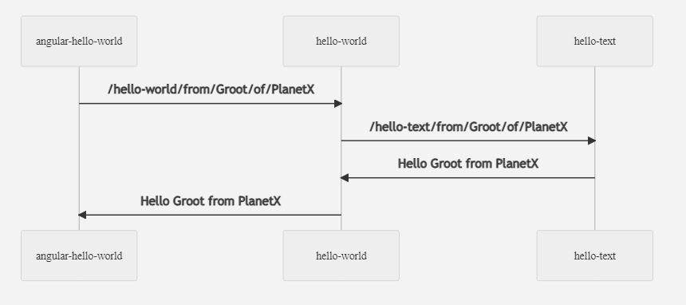
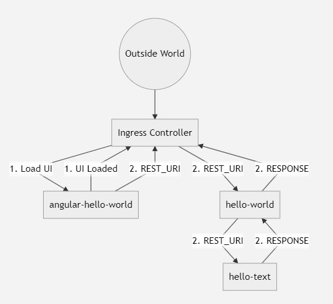

[](https://github.com/ravi2519/hello-world-kubernetes/actions/workflows/build.yaml)

# Hello World example for Kubernetes Deployment on AKS/GKE!

This repository contains all the required configuration and skeleton structure to create production deployable microservices.

#  Head to Toe

Following are all the components from Head to Toe that are required for this deployment. 

- Microservices
- GKE/AKS cluster
- Dockerfile
- Deployment YAML file
- Kustomization YAML file
- Secrets
- GitHub Action YAML file

## 1. Microservices

There are three microservices in this monorepo. You are free to separate them out as independent repositories. 

- angular-hello-world : An angular app that will get containerised inside a [Nginx](https://hub.docker.com/_/nginx) server.
- hello-world: Spring boot microservice that just make a Get request to `hello-text` microservice to fetch some response. 
- hello-text: Spring boot microservice that will send back a text based upon the input received.



## 2. AKS/GKE Cluster
Create either of AKS or GKE cluster as per your requirement. 

### GKE Cluster
- Google Cloud provides [Google Kuberenets Engine](https://cloud.google.com/kubernetes-engine). 
- A bare-minimum GKE cluster can be created easily from [Google Cloud Console](https://console.cloud.google.com/kubernetes).  
- [Install ingress controller on GKE](https://cloud.google.com/community/tutorials/nginx-ingress-gke)

### AKS Cluster
- Azure Cloud provides [Azure Kuberenets Services](https://azure.microsoft.com/en-in/services/kubernetes-service/). 
- A bare-minimum AKS cluster can be created easily from [Azure Portal](https://portal.azure.com/).  
- [Install ingress controller on AKS](https://docs.microsoft.com/en-us/azure/aks/ingress-basic)


REST_URI: `from/Groot/of/PlanetX`
RESPONSE: `Hello Groot from PlantX`

## 3. Dockerfile

Dockerfile is required inside every microservice to build and containerize.
List of Dockerfiles present in this monorepo are:

- `angular-hello-world/Dockerfile`
- `helloworldkubernetes/Dockerfile`
- `hellotextkubernetes/Dockerfile`

> NOTE: GitHub Actions will run these Dockerfiles and create respective Docker images. These images will get pushed to [Docker Hub](https://hub.docker.com/). Keep your docker hub account ready as well.

> GitHub Action will take care to add a tag for the image.  

## 4. Deployment YAML File

Deployment YAML files are used to perform deployment of the images created from #3 to Kubernetes Cluster. The list of Deployment YAML files in this monorepo are:

-`angular-hello-world/deployment.yaml`
-`helloworldkubernetes/deployment.yaml`
-`hellotextkubernetes/deployment.yaml`

Each one of these deployment file will add a [Workload](https://kubernetes.io/docs/concepts/workloads/) to the Keubernetes Cluster and create a [ClusterIP Service](https://kubernetes.io/docs/concepts/services-networking/service/).

> NOTE: The 'image' property inside each of these deployment yaml files is set to a template key 
> `image: USERNAME/IMAGE1:TAG`. This will get replaced with the actual values in next step.

## 5. Kustomization YAML file

The following template key present in the Deployment YAML file will get replaced by the actual image name and tag when a GitHub Action is running. This is done using [Kustomize](https://kustomize.io/).
```
.
.
image: USERNAME/IMAGE1:TAG
.
.
```

## 6. Secrets

[Secrets need to be configured](https://docs.github.com/en/actions/reference/encrypted-secrets) inside the repo to help GitHub Actions to securely connect to Docker Hub, and AKS or GKE.  

### [Add following Docker Hub Secrets](https://docs.docker.com/ci-cd/github-actions/)
- DOCKER_HUB_USERNAME
- DOCKER_HUB_ACCESS_TOKEN

### [Add following GKE Secrets for Google cloud deployment](https://docs.github.com/en/actions/guides/deploying-to-google-kubernetes-engine)
- GKE_PROJECT : Project Name on google cloud
- GKE_CLUSTER : GKE Cluster name
- GKE_ZONE : GKE Zone
- GKE_SA_KEY : SA Key

### [Add following AKS Secrets for Azure cloud deployment](https://docs.microsoft.com/en-us/azure/aks/kubernetes-action)
- AKS_CLUSTER : GKE Cluster name
- AZURE_CREDENTIALS : Azure Resource Group

> Click on header of above sections to go through the steps required to create the respective secrets.

## 7. GitHub Action YAML file
Inside `.github/workflows`, two YAML files are present. 
`build.yaml` --> GitHub Actions for complete CICD to AKS
`build_GKE.yaml` -->  GitHub Actions for complete CICD to GKE

These acts as separate Workflows under GitHub Actions, which can be enabled or disabled from "Action" tab.

